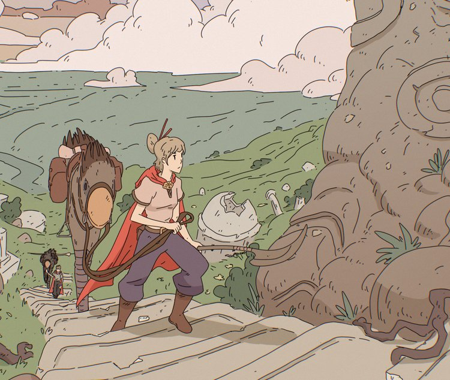

Hey, se você é fã de música instrumental, eu tenho uma recomendação incrível para você: o canal [Blue Turtle](https://www.youtube.com/@BlueTurtle) no YouTube!

Seja para relaxar, estudar ou trabalhar, uma música “calminha” vai bem não é mesmo?

O legal é que existem vários gêneros musicais com essa premissa para você encontrar o seu *flow*: downtempo, uptempo, hiphop beats, bossa nova, clássica, chill, etc. São muitas opções!

Esse canal é uma verdadeira joia para quem ama ouvir músicas ambiente e aprecia a sonoridade de diversos instrumentos.

O canal é repleto de sons *bacanudos* para os diferentes gostos – mas o foco mesmo é em construir uma atmosfera de fantasia.

No Blue Turtle acompanhamos a jovem estudante de magia *Ithyä*, nos diferentes ambientes que ela percorre em sua jornada, como o mercado de [Oltak's](https://youtu.be/LrOUEdRpeVk) ou em uma [biblioteca mágica](https://youtu.be/DIpU7vdxFZI).

O canal também conta com belas imagens e animações visuais, que acompanham a música, proporcionando uma experiência audiovisual agradável. 

. ")

Ah, e eu adorei o estilo das ilustrações e animações, que me lembram sob medida os mundos do quadrinhista [Jean Giraud](https://www.wikiwand.com/pt/Jean_Giraud), e o clima de jogos como [Sable](https://www.youtube.com/watch?v=GEPVqubJriA).

Nem preciso dizer que eu adoro um mundo de ficção e fantasia né?

Então se você curte um som ameno no ambiente, vá lá conferir agora mesmo e se prepare para se encantar com as belas músicas instrumentais que esse canal tem a oferecer!

Dica marota: Blue Turtle ainda não tem um perfil no Spotify, mas uma pessoa de bom coração criou uma lista com as músicas que toca no canal: [Blue Turtle - playlist by Chase Tramel | Spotify](https://open.spotify.com/playlist/6CIbaJfC4c9kLtvc8oLqip?si=5a88f1b8e06b408b).

---

E tu pessoa, o que anda ouvindo para relaxar ou focar? Adoraria descobrir! Deixa aí nos comentários ;)

🍃 Até breve e curta esses mundos fantásticos através da música.