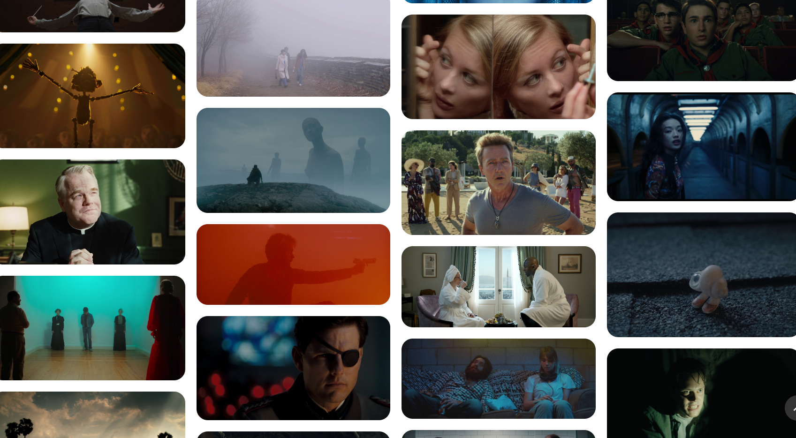

Provavelmente você também ama filmes, series e no geral, uma boa narrativa visual né?

Já sentiu aquela saudade após maratonar uma série? Ou aquele êxtase quando termina um bom filme? Ou ainda aquela vontade de re-ouvir a trilha sonora do game que zerou?

Gosto de classificar essas sensações como “sentimentos abstratos”, que vibram quando vemos algo que ressoa conosco. Desconfio que parte dessa “magia” abstrata é não definirmos claramente essas sensações.

O fato é que tem coisas que queremos e vemos mais de uma vez – e não muito, quando revemos temos outra interpretação, por ser outro momento. 

Refletindo sobre essas saudades abstratas e magicas, você já percebeu que tem quase que um gênero textual-visual na internet sobre os melhores momentos dos filmes? 

Não são os trailers ou resenhas. Talvez você até siga algumas contas no *TikTok* ou *Twitter* que são especificamente sobre recortes audiovisuais de filmes e series.


  
O propósito desses recortes é permitir que os fãs compartilhem as cenas mais impactantes das histórias que amam. Criticos de cinema se reúnem para trocar ideias e rever os momentos mais interessantes sobras as obras cinematográficas, não é mesmo?

A internet abriu um campo horizontal, criando espaços para as pessoas compartilhar e interagir sobre as narrativas que amam.

Nesse *post* vou compartilhar com você alguns dos melhores canais do YouTube sobre essa forma de amor por obras audiovisuais – recortes-resumos - esbanjando toda a beleza e sentimento.

# Revisar é viver

Geralmente esses vídeos têm uma definição de 1920x1080 (Full HD), com a trilha sonora situada do universo da obra cinematográfica. É quase que um trabalho de curadoria, extraindo resumo estético e simbológico em seleções de 3-5 minutos. É de arrepiar!



Mas você pode estar se perguntando: por que ver essas seleções? 

Porque são incríveis?!

Quando eu vejo algumas dessas seleções, eu me arrepio e até emociono; serio!

É incrível ver como esses mundos ficcionais foram criados e sustentados em coerência de imagem e som, junto a uma narrativa. 

Parte das emoções abstratas de quando eu vi o filme completo – como *Tron: Legacy (2010)* – veem a tona através desses compilados. Confesso que algumas vezes é assim que me inspiro ao começar um projeto – re-assistindo recortes de obras que gosto.

Por fim, gostaria de comentar que eu aprendo muito sobre composição ao ver essas seleções!

**Dica rápida: Inspira-te**

Sobre inspiração, uma dica: tenha pastinha de projetos que inspira você! Isso é um hack ainda mais poderoso se seu trabalho for das "áreas criativas".

# Ta, e os links?

Sem mais de longas, essa é minha seleção pessoal de *links* sobre compilados e inspirações visuais:

- [The Beauty Of - YouTube](https://www.youtube.com/@TheBeautyOf/featured)
	- Um dos meus canais favoritos do gênero, tem *playlists* separadas por filmes, diretores e nacionalidade;
- [Amazing Shots - YouTube](https://www.youtube.com/@AmazingShots)
	- Muito bem atualizado, as seleções são simples e diretas ao ponto;
- [Crusade588 - YouTube](https://www.youtube.com/@crusade5886)
	- As seleções são focadas nos arquétipos e construções de personagens, como Darth Vader, Paz Vizsla e Walter White. É muito interessante!
- [Silver Screens - YouTube](https://www.youtube.com/@Silver_Screens)
	- O que eu mais gosto é que além das obras mais recentes também tem compilados de filmes de outros seculos e décadas, como o [Cidadão Kane (1940)](https://youtu.be/l9xcGNJ8lTI)
- [The Vibes Of - YouTube](https://www.youtube.com/@TheVibesOf)
	- O foco desse canal é capturar a atmosfera construída sobre a obra. Por isso o “vibe” no nome;
- [Flurdeh - YouTube](https://www.youtube.com/@Flurdeh)
	- Lindas seleções de jogos;
- [GameClips - YouTube](https://www.youtube.com/@GameClips4KYT)
	- Não são bem seleções, são *cinematics* de jogos, que por vezes “escapa” da jogatina. Esse canal é quase uma biblioteca desses trechos de jogos;
- Bônus - Seleções somente em imagens
	- [FILMGRAB](https://film-grab.com)
	- [MovieStillsDB](https://www.moviestillsdb.com)
	- [Vagebond's Movie ScreenShots](http://moviescreenshots.blogspot.com)
	- [Movie- Screencaps](https://movie-screencaps.com)
	- [Mostly Screenshots](https://boardchairman-blog.tumblr.com)

---

# Enfim

Por hoje é isso! Eu queria só passar e compartilhar esses espaços digitais que me inspira pacas.

Ah, eu também tenho meus compilados  – mas funciona em formato de diário visual do que eu assisto; veja em → [in1screenshot](https://in1screenshot.renergarden.online/home/).

E você? Tem algum recurso que te inspira e emociona sobre a magia das imagens em movimento? Compartilha aqui nos comentários!

Até breve e inspire-se!
