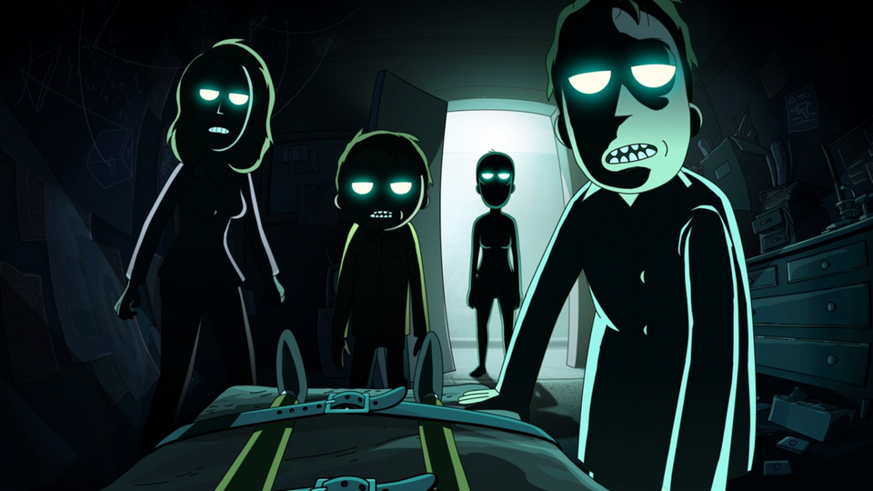
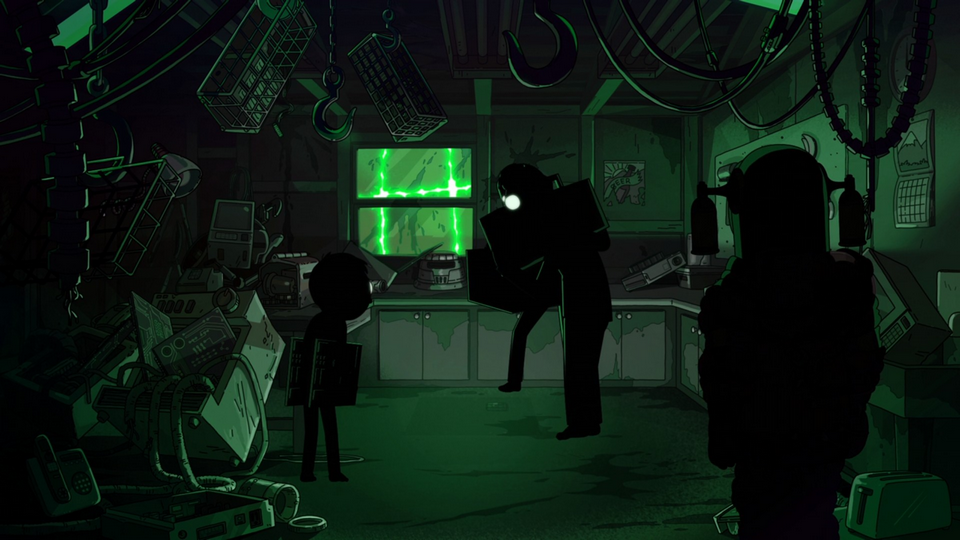
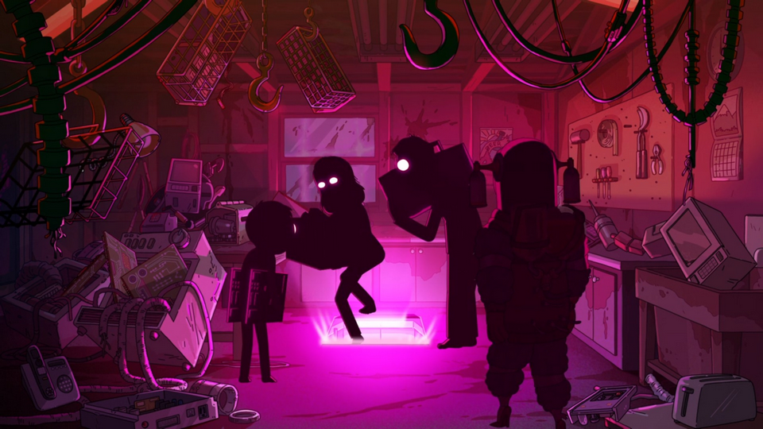
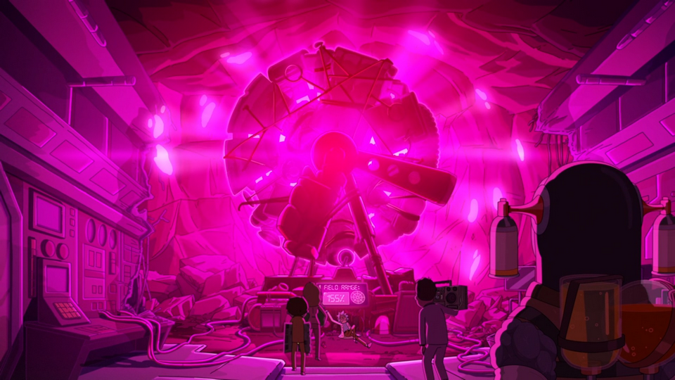
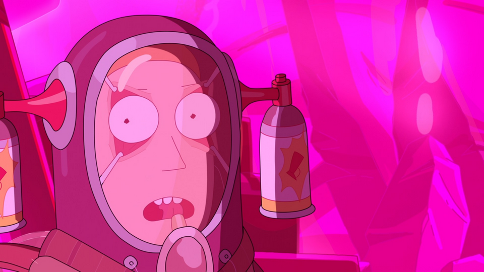
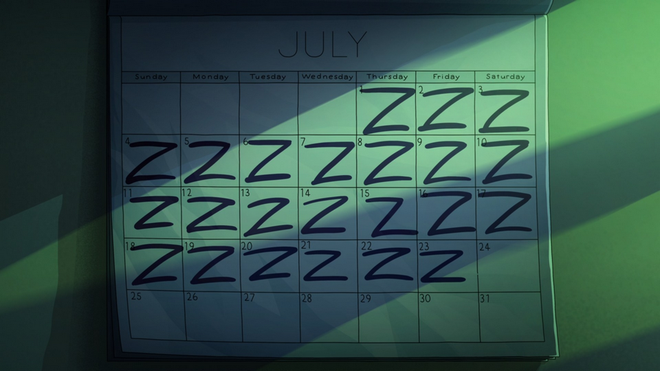
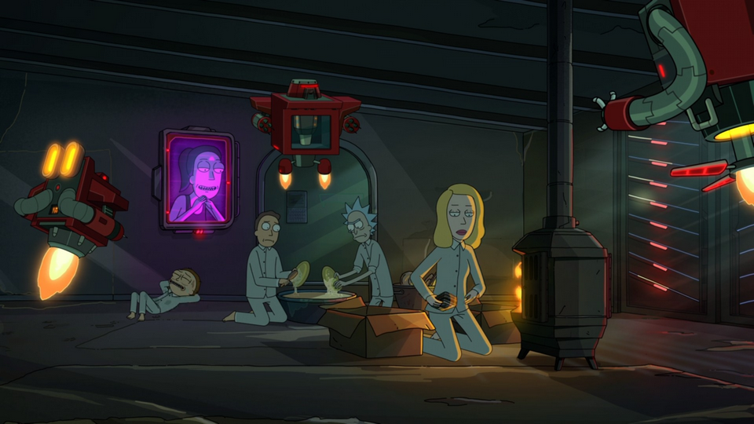
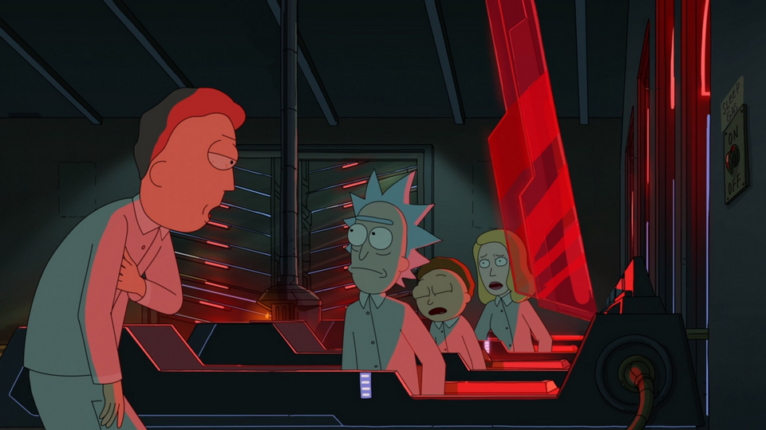

Nesse episódio, vemos os dramas da família noturna contra a família de vigília – e sim, estou te provocando a ver Rick and Morty, nem que comece na quinta temporada.

Eu acho muito interessante como as cores geram contraste e tensão em ressonância com o tema do episódio. O uso de cores fluorescentes também ajuda a criar uma atmosfera dramática nas cenas.

A iluminação é utilizada de maneira genial para separar planos; veja o exemplo abaixo, onde conseguimos ver parte da cena externa da casa, ambiente interno e os personagens:

O contraste é um dos principais elementos para gerar a ilusão de perspectiva e profundidade. Um dos conceitos que se aprende ao estudar ilustração é o de silhuetas, que utilizase da escala de cinza para criar contraste entre os planos:

 ")

Ainda sobre iluminação e cores, é bacana como a direção usa essse elemento para criar uma sensação atmosférica no ambiente:

Qual é o destaque disso tudo? É que simplificar a realidade não é tão simples como parece – e a direção de arte de Rick e Morty tem habilidade para resumir o real em planos estilizados; e ainda assim compor cenas fotográficas e coerentes com a proposta da animação:

Quer ver outro exemplo interessante do uso de cores e iluminação para definir planos estilizados? Veja a série [Hilda, da Netflix](https://www.netflix.com/br/title/80115346).

---

**Rick and Morty – 6X04: Night Family (EUA, 25 de setembro de 2022)**  
**Criação:** Justin Roiland, Dan Harmon  
**Direção:** Jacob Hair  
**Roteiro:** Rob Schrab  
**Elenco:** Justin Roiland, Chris Parnell, Spencer Grammer, Sarah Chalke  
**Duração:** 22 min.

---

Você pode maratonar [Rick e Morty no HBO Max](https://www.hbomax.com/br/pt/series/urn:hbo:series:GXkRjxwjR68PDwwEAABKJ).

Até breve.

---

*Todos os direitos das imagens apresentadas aqui são reservados aos seus criadores/produtores.*
